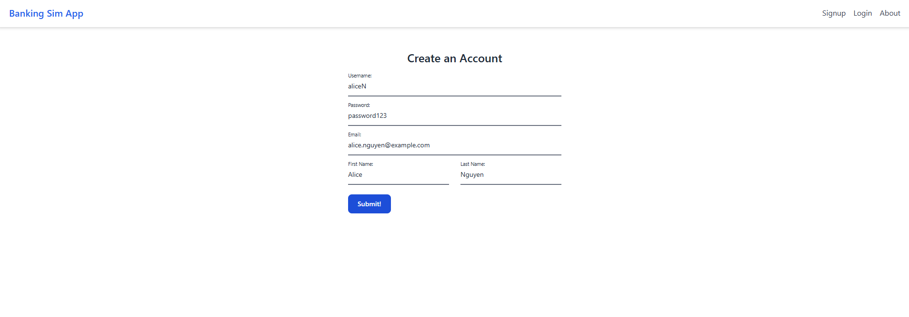
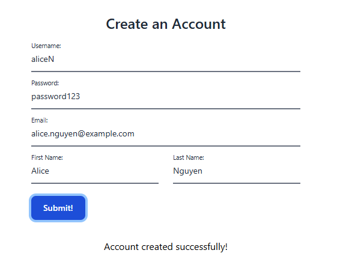
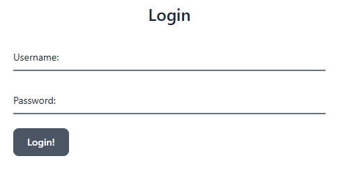
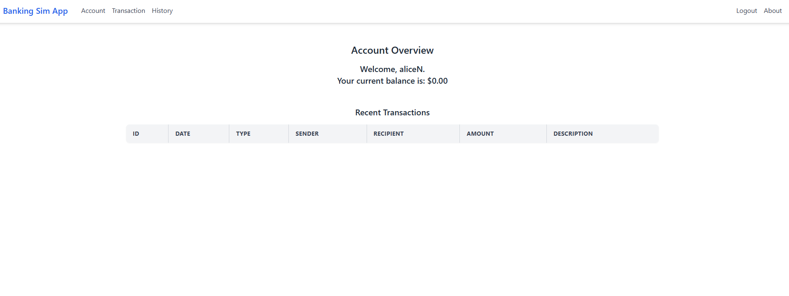
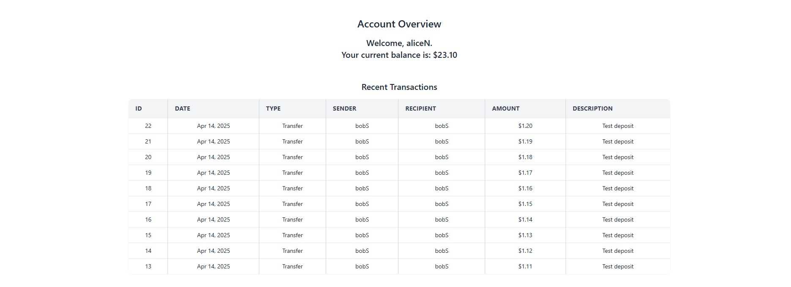
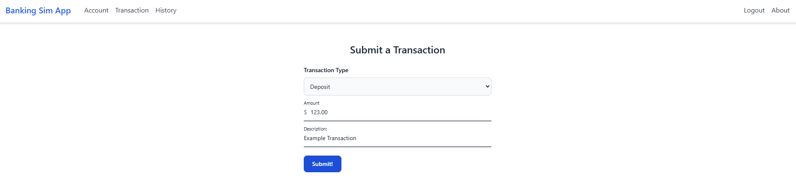
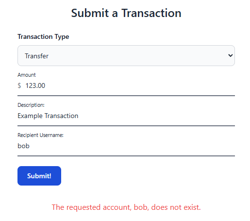
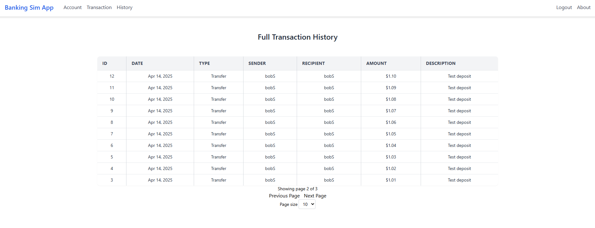
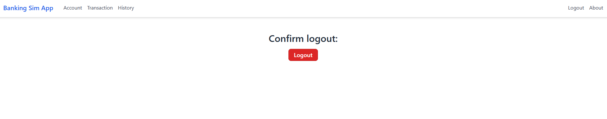

# Simulated Banking Full Stack Project

## Table of Contents
- [Features](#features)
  - [Signup](#signup)
  - [Login](#login)
  - [Account](#account)
  - [Transaction](#transaction)
  - [Transaction History](#transaction-history)
  - [Logout](#logout)
- [Tech Stack](#tech-stack)
  - [Frontend](#frontend)
  - [Backend](#backend)
  - [Authentication](#authentication)
  - [Devtool](#devtool)
- [Setup](#setup)
  - [Backend Requirements](#backend-requirements)
  - [Backend Setup Instructions](#backend-setup-instructions)
  - [frontend Requirements](#frontend-requirements)
  - [frontend Setup Instructions](#frontend-setup-instructions)
- [Potential Improvements and Successes](#potential-improvements-and-successes)
  - [Potential Improvements](#potential-improvements)
  - [Successes](#successes)

# Features

## Signup

Signup by filling in the form and pressing submit. This sends a request to the backend. After verifying uniqueness of username and email, and the completion of all fields, the backend will create a new user and account.




## Login

Login by entering username and password. The backend will receive this request and validate the password against the hashed password for that username to see if they match. If the password is correct, a http-only cookie will be sent in the response containing a authentication token which is valid for one hour. The user will then be redirected to the account page.



## Account

The account page sends a request to the backend with the authentication token. If it is valid, the backend will retrieve and send basic account information to the client.





## Transaction

In the interface, only the transaction type, "transfer", will show the field of "recipient username". When submitted, the backend will verify account balances, existence of the recipient, and process the transaction. 





## Transaction History

The transaction history page allows users to view all transactions that involve them, including transactions where they are marked as a recipient. It uses pageable, and allows users to change the page, or the page size. It is sorted with the most recent transactions being shown first. Though it only shows calendar date, precise date/time is used.

This is implemented using a custom sql query. "Many to one" relationships are used with transactions and accounts to retrieve information such as accounts associated with transactions, and the users associated with the accounts.



## Logout

Logout clears all stored data, including cookies and other locally stored account data. It makes a request to the backend, and the backend responds with an empty http-only authentication token, overwriting the previously stored one. 




# Tech Stack

## Frontend
 - Vue 3: Frontend framework (Composition API)
 - Vite: Dev server
 - Vue Router: client-side routing
 - Pinia: State management
 - Axios: Backend communication
 - Tailwind CSS: Styling
 - JavaScript/HTML: Core technologies

## Backend
 - Spring Boot: Java backend framework
 - Spring Web: RESTful API creation
 - PostgreSQL: Relational database
 - Spring Data JPA: Java Persistence API
 - JDBC/Hibernate: Database access with JPA
 - schema.sql: DB blueprint

## Authentication
 - JWT (JSON Web Token): Stateless authentication
 - HTTP-only Cookies: Secure client-side toekn storage

## Devtool
 - Maven: java build tool and dependency management
 - Node.js + npm: Frontend dependency management
 - VS Code: Frontend IDE
 - IntelliJ Idea: Backend IDE
 - PoastgreSQL CLI: DB management

# Setup

## Backend Requirements
 - Java 17+
 - Maven
 - PostgreSQL
   - A postgreSQL database named 'userdb'
   - An environment variable, 'DB_PASSWORD' for the PostgreSQL 'postgres' user


## Backend Setup Instructions

### 1. Clone the repository

```bash
git clone https://github.com/jmeyer2030/BankingWebApp.git

cd bankingwebapp/banking-backend
```

### 2. Make sure PostgreSQL is running locally, then make the database

```bash
psql -U postgres
CREATE DATABASE userdb;
```

### 3. Set the environment variable
For a session evironment variable:
```bash
$env:DB_PASSWORD = "password"
```
Or create a persistent environment variable:
```bash
[System.Environment]::SetEnvironmentVariable("DB_PASSWORD", "password", "User")
```

### 4. Build and run the backend
In the banking-backend directory
```bash
mvn clean install
mvn spring-boot:run
```

## Frontend Requirements
 - Node.js
 - npm

 ## Frontend Setup Instructions


 ### Install Dependencies
navigate to "bankingwebapp/banking-frontend" and install dependencies
 ```bash
 cd banking-frontend
 npm install
 ```

### Run

 ```bash
 npm run dev
 ```


# Potential Improvements and Successes

## Potential improvements

This obviously doesn't have all the desired features of a banking app and wasn't intended to be, and it is tough to decide when a project is "done" since they never really are. That being said, some features and improvements that I think would be benefitial to implement are:
 - Race condition testing and features for transaction security
 - Maybe more frequent authentication from the backend. Even though when information is retrieved from the backend there is always a authentication check, I think on page reload, authenticating, then clearing locally stored information if the auth token expired would be good.
 - More response consitency in the backend. All responses should be in the format of the "ApiResponse" class, this would make writing the frontend easier and more normal.
 - Multiple account features. This could be things like simulating a brokerage account or savings account.

## Successes

Some things were done well I think, and it is worth pointing them out for reference in any RESTful apis I make in the future.
 - Separation of concerns in services, controllers, etc.
 - Database structure. I really liked the "Many to one" relationships that allowed really convenient access to more detailed information about transactions.
 - General expandability of features in the API. Because some things were done well, I think it would be relatively easy to add more features, such as some of the things I mentioned in the improvements section.
 - Frontend styling is pretty clean, despite not really being a focus.